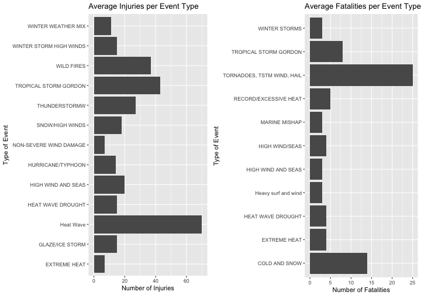
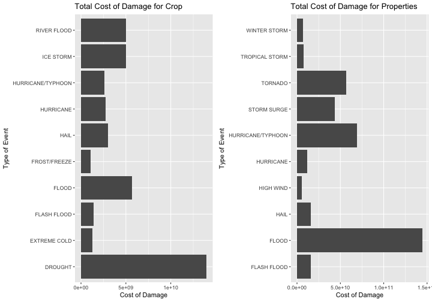

Influence of Natural Events, Across the US, Over Population Health and Economic Well-Being
========================================================================================

## Synopsis

The purpose of the current analysis is to describe which natural events, across the US, are most harmful for the population health within the country, as well as have the greatest economic impact, between the year 1950 and end of November 2011. The overall hypothesis is that the types of events that are more harmful for the US population health are heat waves, cold and snow, as well as tornadoes and hail. In addition, the believed event types that has the greatest economic impact are drought and floods. To investigate this hypothesis, the current analysis is based on a data obtained by the U.S. National Oceanic and Atmospheric Administration's (NOAA) storm database. The analysis of the data confirms that the most harmful events for the US population health are heat waves, cold and snow, as well as tornadoes and hail. Also, the analysis confirmed that the events that have the greatest economic impact are drought and floods.

## Data processing

The current analysis is based on a data obatained by the U.S. National Oceanic and Atmospheric Administration's (NOAA) storm database, which covers the year 1950 and end of November 2011.

### Reading in the data

Read the file into a data set. The file is comma-separated values (CSV) compressed file with an extension BZ2. In R, such files are read with the function read.csv.


```r
noaaData <- read.csv("repdata-data-StormData.csv.bz2", header = TRUE, sep = ",")
```

### Analysis for Question 1

#### "1. Across the United States, which types of events (as indicated in the EVTYPE variable) are most harmful with respect to population health?"

Take a look at the data set's structure.


```r
str(noaaData)
```

```
## 'data.frame':	902297 obs. of  37 variables:
##  $ STATE__   : num  1 1 1 1 1 1 1 1 1 1 ...
##  $ BGN_DATE  : Factor w/ 16335 levels "1/1/1966 0:00:00",..: 6523 6523 4242 11116 2224 2224 2260 383 3980 3980 ...
##  $ BGN_TIME  : Factor w/ 3608 levels "00:00:00 AM",..: 272 287 2705 1683 2584 3186 242 1683 3186 3186 ...
##  $ TIME_ZONE : Factor w/ 22 levels "ADT","AKS","AST",..: 7 7 7 7 7 7 7 7 7 7 ...
##  $ COUNTY    : num  97 3 57 89 43 77 9 123 125 57 ...
##  $ COUNTYNAME: Factor w/ 29601 levels "","5NM E OF MACKINAC BRIDGE TO PRESQUE ISLE LT MI",..: 13513 1873 4598 10592 4372 10094 1973 23873 24418 4598 ...
##  $ STATE     : Factor w/ 72 levels "AK","AL","AM",..: 2 2 2 2 2 2 2 2 2 2 ...
##  $ EVTYPE    : Factor w/ 985 levels "   HIGH SURF ADVISORY",..: 834 834 834 834 834 834 834 834 834 834 ...
##  $ BGN_RANGE : num  0 0 0 0 0 0 0 0 0 0 ...
##  $ BGN_AZI   : Factor w/ 35 levels "","  N"," NW",..: 1 1 1 1 1 1 1 1 1 1 ...
##  $ BGN_LOCATI: Factor w/ 54429 levels ""," Christiansburg",..: 1 1 1 1 1 1 1 1 1 1 ...
##  $ END_DATE  : Factor w/ 6663 levels "","1/1/1993 0:00:00",..: 1 1 1 1 1 1 1 1 1 1 ...
##  $ END_TIME  : Factor w/ 3647 levels ""," 0900CST",..: 1 1 1 1 1 1 1 1 1 1 ...
##  $ COUNTY_END: num  0 0 0 0 0 0 0 0 0 0 ...
##  $ COUNTYENDN: logi  NA NA NA NA NA NA ...
##  $ END_RANGE : num  0 0 0 0 0 0 0 0 0 0 ...
##  $ END_AZI   : Factor w/ 24 levels "","E","ENE","ESE",..: 1 1 1 1 1 1 1 1 1 1 ...
##  $ END_LOCATI: Factor w/ 34506 levels ""," CANTON"," TULIA",..: 1 1 1 1 1 1 1 1 1 1 ...
##  $ LENGTH    : num  14 2 0.1 0 0 1.5 1.5 0 3.3 2.3 ...
##  $ WIDTH     : num  100 150 123 100 150 177 33 33 100 100 ...
##  $ F         : int  3 2 2 2 2 2 2 1 3 3 ...
##  $ MAG       : num  0 0 0 0 0 0 0 0 0 0 ...
##  $ FATALITIES: num  0 0 0 0 0 0 0 0 1 0 ...
##  $ INJURIES  : num  15 0 2 2 2 6 1 0 14 0 ...
##  $ PROPDMG   : num  25 2.5 25 2.5 2.5 2.5 2.5 2.5 25 25 ...
##  $ PROPDMGEXP: Factor w/ 19 levels "","-","?","+",..: 17 17 17 17 17 17 17 17 17 17 ...
##  $ CROPDMG   : num  0 0 0 0 0 0 0 0 0 0 ...
##  $ CROPDMGEXP: Factor w/ 9 levels "","?","0","2",..: 1 1 1 1 1 1 1 1 1 1 ...
##  $ WFO       : Factor w/ 542 levels ""," CI","%SD",..: 1 1 1 1 1 1 1 1 1 1 ...
##  $ STATEOFFIC: Factor w/ 250 levels "","ALABAMA, Central",..: 1 1 1 1 1 1 1 1 1 1 ...
##  $ ZONENAMES : Factor w/ 25112 levels "","                                                                                                               "| __truncated__,..: 1 1 1 1 1 1 1 1 1 1 ...
##  $ LATITUDE  : num  3040 3042 3340 3458 3412 ...
##  $ LONGITUDE : num  8812 8755 8742 8626 8642 ...
##  $ LATITUDE_E: num  3051 0 0 0 0 ...
##  $ LONGITUDE_: num  8806 0 0 0 0 ...
##  $ REMARKS   : Factor w/ 436781 levels "","\t","\t\t",..: 1 1 1 1 1 1 1 1 1 1 ...
##  $ REFNUM    : num  1 2 3 4 5 6 7 8 9 10 ...
```

Take a look at the EVTYPE variable. We see that there are 985 levels of different types of events, spread out within almost a million observations, or 902297 observations to be precise.

Let's look only at the types of variables available (with the names() function) and the provided documentation, to check which variable/s corresponds to "population health."


```r
names(noaaData)
```

```
##  [1] "STATE__"    "BGN_DATE"   "BGN_TIME"   "TIME_ZONE"  "COUNTY"    
##  [6] "COUNTYNAME" "STATE"      "EVTYPE"     "BGN_RANGE"  "BGN_AZI"   
## [11] "BGN_LOCATI" "END_DATE"   "END_TIME"   "COUNTY_END" "COUNTYENDN"
## [16] "END_RANGE"  "END_AZI"    "END_LOCATI" "LENGTH"     "WIDTH"     
## [21] "F"          "MAG"        "FATALITIES" "INJURIES"   "PROPDMG"   
## [26] "PROPDMGEXP" "CROPDMG"    "CROPDMGEXP" "WFO"        "STATEOFFIC"
## [31] "ZONENAMES"  "LATITUDE"   "LONGITUDE"  "LATITUDE_E" "LONGITUDE_"
## [36] "REMARKS"    "REFNUM"
```

The variables that seem to directly influence and thus correspond to the population's health are "FATALITIES" and "INJURIES".

Let's subset the three variables "EVTYPE", "FATALITIES", and "INJURIES", and create new data set with them.


```r
healthData <- subset(noaaData, select = c(EVTYPE, FATALITIES, INJURIES))
```

Next, we calculate the mean values of "FATALITIES" and "INJURIES" for every "EVTYPE" factor, using the "dplyr" package and create a new data set with these new values.


```r
library(dplyr)

healthDataMeans <- healthData %>% group_by(EVTYPE) %>% summarise_all(funs(mean))

str(healthDataMeans)
```

```
## Classes 'tbl_df', 'tbl' and 'data.frame':	985 obs. of  3 variables:
##  $ EVTYPE    : Factor w/ 985 levels "   HIGH SURF ADVISORY",..: 1 2 3 4 5 6 7 8 9 10 ...
##  $ FATALITIES: num  0 0 0 0 0 0 0 0 0 0 ...
##  $ INJURIES  : num  0 0 0 0 0 0 0 0 0 0 ...
```

We need integer numbers, i.e. whole numbers, in the "FATALITIES" and "INJURIES" variables, in order to better read and understand the results. In other words, we need an easier way to count the number of fatalities and injuries per event type. That is why we set the type of the variables mentioned above to integer.


```r
healthDataMeans$FATALITIES <- as.integer(healthDataMeans$FATALITIES)
healthDataMeans$INJURIES <- as.integer(healthDataMeans$INJURIES)

str(healthDataMeans)
```

```
## Classes 'tbl_df', 'tbl' and 'data.frame':	985 obs. of  3 variables:
##  $ EVTYPE    : Factor w/ 985 levels "   HIGH SURF ADVISORY",..: 1 2 3 4 5 6 7 8 9 10 ...
##  $ FATALITIES: int  0 0 0 0 0 0 0 0 0 0 ...
##  $ INJURIES  : int  0 0 0 0 0 0 0 0 0 0 ...
```

Next, since there are 985 observations and many "EVTYPE", or types of events, with an average value of "FATALITIES" and "INJURIES" equal to 0, the data set can be optimized by cleaning these values. The 0 values can be replaced with NA, in order to use the argument na.rm = TRUE/FALSE later when plotting and using other functions. Before we go any further with such computations we need to make a copy of the data set, as backup.


```r
healthDataMeansNa <- healthDataMeans

healthDataMeansNa[healthDataMeansNa == 0] <- NA
```

Let's check the summary of the data. It can give us idea how it is distributed and what values are critical to answering the main question.


```r
summary(healthDataMeansNa$FATALITIES)
```

```
##    Min. 1st Qu.  Median    Mean 3rd Qu.    Max.    NA's 
##   1.000   1.000   1.000   2.365   2.000  25.000     933
```

```r
summary(healthDataMeansNa$INJURIES)
```

```
##    Min. 1st Qu.  Median    Mean 3rd Qu.    Max.    NA's 
##   1.000   1.000   2.000   6.517   5.250  70.000     925
```

Going furhter, the following code subsets the data set only with the type of events and the corresponding number of fatalities. In addition, it cleans the rows with NA values.


```r
maxFatal <- subset(healthDataMeansNa, select = c(EVTYPE, FATALITIES))
maxFatalNoNa <- maxFatal[complete.cases(maxFatal), ]
```

Since the 3rd quantile of the data in the "FATALITIES" variable is 2, that number of fatalities can be the standard for "most harmful", as asked in the main question. There can be one more data set showing only the "most harmful" event types and corresponding number of fatalities, i.e. more than 2.


```r
maxFatalFinal <- maxFatalNoNa[maxFatalNoNa$FATALITIES > 2, ]
```

Going furhter, the following code subsets the data set only with the type of events and the corresponding number of injuries. In addition, it cleans the rows with NA values.


```r
maxInj <- subset(healthDataMeansNa, select = c(EVTYPE, INJURIES))
maxInjNoNa <- maxInj[complete.cases(maxInj), ]
```

Since the 3rd quantile of the data in the "INJURIES" variable is 5.25, that number of injuries can be the standard for "most harmful", as asked in the main question. There can be one more data set showing only the "most harmful" event types and corresponding number of injuries, i.e. more than 5.25, or more than 6 (as the next whole number).


```r
maxInjFinal <- maxInjNoNa[maxInjNoNa$INJURIES > 6, ]
```

Finally, the two-panel plot, in the Results section (Results for Question 1) of the current analysis, shows the graphical representation of the "most harmful" event types.

### Analysis for Question 2

#### "2. Across the United States, which types of events have the greatest economic consequences?"

Since we already loaded the main data, as a next step, we look at the types of variables available (with the names() function) and the provided documentation, to check which variable/s have direct "economic consequences."


```r
names(noaaData)
```

```
##  [1] "STATE__"    "BGN_DATE"   "BGN_TIME"   "TIME_ZONE"  "COUNTY"    
##  [6] "COUNTYNAME" "STATE"      "EVTYPE"     "BGN_RANGE"  "BGN_AZI"   
## [11] "BGN_LOCATI" "END_DATE"   "END_TIME"   "COUNTY_END" "COUNTYENDN"
## [16] "END_RANGE"  "END_AZI"    "END_LOCATI" "LENGTH"     "WIDTH"     
## [21] "F"          "MAG"        "FATALITIES" "INJURIES"   "PROPDMG"   
## [26] "PROPDMGEXP" "CROPDMG"    "CROPDMGEXP" "WFO"        "STATEOFFIC"
## [31] "ZONENAMES"  "LATITUDE"   "LONGITUDE"  "LATITUDE_E" "LONGITUDE_"
## [36] "REMARKS"    "REFNUM"
```

As the provided information shows, the variables that have direct economic impact, in terms of monetary consequences, or recorded losses, are "PROPDMG" and "PROPDMGEXP", as well as "CROPDMG" and "CROPDMGEXP". That corresponds to property damage and property damage expenses, as well as crop damage and crop damage expenses, respectively. The two corresponding pairs combine in them the amount of money that the damage caused. The fisrst variable of each pair represents the number and the second shows the number of zeros (e.g. H, K, M, or B, i.e. whether the number in the first variable is in hundreds, thousands, millions, or billions, repsectively).

The following two steps subset the variables mentioned above - one data set for cost of damage for properties and one for cost of damage for crop, along with the types of events that caused them (in each data set).


```r
propDmgExp <- subset(noaaData, select = c(EVTYPE, PROPDMG, PROPDMGEXP))
cropDmgExp <- subset(noaaData, select = c(EVTYPE, CROPDMG, CROPDMGEXP))
```

Let's take a look at the structure and the unique values within the two data sets.


```r
str(propDmgExp)
```

```
## 'data.frame':	902297 obs. of  3 variables:
##  $ EVTYPE    : Factor w/ 985 levels "   HIGH SURF ADVISORY",..: 834 834 834 834 834 834 834 834 834 834 ...
##  $ PROPDMG   : num  25 2.5 25 2.5 2.5 2.5 2.5 2.5 25 25 ...
##  $ PROPDMGEXP: Factor w/ 19 levels "","-","?","+",..: 17 17 17 17 17 17 17 17 17 17 ...
```

```r
str(cropDmgExp)
```

```
## 'data.frame':	902297 obs. of  3 variables:
##  $ EVTYPE    : Factor w/ 985 levels "   HIGH SURF ADVISORY",..: 834 834 834 834 834 834 834 834 834 834 ...
##  $ CROPDMG   : num  0 0 0 0 0 0 0 0 0 0 ...
##  $ CROPDMGEXP: Factor w/ 9 levels "","?","0","2",..: 1 1 1 1 1 1 1 1 1 1 ...
```

```r
unique(propDmgExp$PROPDMGEXP)
```

```
##  [1] K M   B m + 0 5 6 ? 4 2 3 h 7 H - 1 8
## Levels:  - ? + 0 1 2 3 4 5 6 7 8 B h H K m M
```

```r
unique(cropDmgExp$CROPDMGEXP)
```

```
## [1]   M K m B ? 0 k 2
## Levels:  ? 0 2 B k K m M
```

In each of the two data sets (the one for property damage and the one for crop damage), the variable that shows whether the number is in hundreds, thousands, millions, or billions has factors that don't give the required information. In addition, there are many 0 monetary values, and a corresponding "" (or blank) value as its type of expense.

Since the needed values are only the ones in hundreds, thousands, millions, or billions, the following code converts the expense type variable from class factor to class character and extracts the repsective characters for hundreds (h, H), thousands (k, K), millions (m, M), or billions (B).

The following code applies to the property data:


```r
propDmgExp$PROPDMGEXP <- as.character(propDmgExp$PROPDMGEXP)
str(propDmgExp)
```

```
## 'data.frame':	902297 obs. of  3 variables:
##  $ EVTYPE    : Factor w/ 985 levels "   HIGH SURF ADVISORY",..: 834 834 834 834 834 834 834 834 834 834 ...
##  $ PROPDMG   : num  25 2.5 25 2.5 2.5 2.5 2.5 2.5 25 25 ...
##  $ PROPDMGEXP: chr  "K" "K" "K" "K" ...
```

```r
unique(propDmgExp$PROPDMGEXP)
```

```
##  [1] "K" "M" ""  "B" "m" "+" "0" "5" "6" "?" "4" "2" "3" "h" "7" "H" "-"
## [18] "1" "8"
```

```r
propDmgExp2 <- propDmgExp[propDmgExp$PROPDMGEXP %in% c("B", "h", "H", "K", "m", "M"), ]
str(propDmgExp2)
```

```
## 'data.frame':	436049 obs. of  3 variables:
##  $ EVTYPE    : Factor w/ 985 levels "   HIGH SURF ADVISORY",..: 834 834 834 834 834 834 834 834 834 834 ...
##  $ PROPDMG   : num  25 2.5 25 2.5 2.5 2.5 2.5 2.5 25 25 ...
##  $ PROPDMGEXP: chr  "K" "K" "K" "K" ...
```

```r
unique(propDmgExp2$PROPDMGEXP)
```

```
## [1] "K" "M" "B" "m" "h" "H"
```

The following code applies to the crop data:


```r
cropDmgExp$CROPDMGEXP <- as.character(cropDmgExp$CROPDMGEXP)
str(cropDmgExp)
```

```
## 'data.frame':	902297 obs. of  3 variables:
##  $ EVTYPE    : Factor w/ 985 levels "   HIGH SURF ADVISORY",..: 834 834 834 834 834 834 834 834 834 834 ...
##  $ CROPDMG   : num  0 0 0 0 0 0 0 0 0 0 ...
##  $ CROPDMGEXP: chr  "" "" "" "" ...
```

```r
unique(cropDmgExp$CROPDMGEXP)
```

```
## [1] ""  "M" "K" "m" "B" "?" "0" "k" "2"
```

```r
cropDmgExp2 <- cropDmgExp[cropDmgExp$CROPDMGEXP %in% c("M", "K", "m", "B", "k"), ]
str(cropDmgExp2)
```

```
## 'data.frame':	283857 obs. of  3 variables:
##  $ EVTYPE    : Factor w/ 985 levels "   HIGH SURF ADVISORY",..: 409 786 405 408 408 786 786 834 834 812 ...
##  $ CROPDMG   : num  10 500 1 4 10 50 50 5 50 15 ...
##  $ CROPDMGEXP: chr  "M" "K" "M" "M" ...
```

```r
unique(cropDmgExp2$CROPDMGEXP)
```

```
## [1] "M" "K" "m" "B" "k"
```

Once the needed data is isolated, the two variables, the one showing the monetary number and the one showing the number of zeros, need to be merged in order to preceed further with the exploratory analysis.

First, we substitute the letters in the variables showing hundreds, thousands, millions, and billions with the corresponding number (e.g. 100, 1000, etc.), so they can be ready for multiplication later on.

The following code applies to the crop data:


```r
cropDmgExp3 <- cropDmgExp2
unique(cropDmgExp3$CROPDMGEXP)
```

```
## [1] "M" "K" "m" "B" "k"
```

```r
cropDmgExp3$CROPDMGEXP <- ifelse(cropDmgExp3$CROPDMGEXP == "M", 1000000,
                                 ifelse(cropDmgExp3$CROPDMGEXP == "m", 1000000,
                                        ifelse(cropDmgExp3$CROPDMGEXP == "K", 1000,
                                               ifelse(cropDmgExp3$CROPDMGEXP == "k", 1000,
                                                      ifelse(cropDmgExp3$CROPDMGEXP == "B", 1000000000, 0)))))

str(cropDmgExp3)
```

```
## 'data.frame':	283857 obs. of  3 variables:
##  $ EVTYPE    : Factor w/ 985 levels "   HIGH SURF ADVISORY",..: 409 786 405 408 408 786 786 834 834 812 ...
##  $ CROPDMG   : num  10 500 1 4 10 50 50 5 50 15 ...
##  $ CROPDMGEXP: num  1e+06 1e+03 1e+06 1e+06 1e+06 1e+03 1e+03 1e+03 1e+03 1e+03 ...
```

The following code applies to the property data:


```r
propDmgExp3 <- propDmgExp2
unique(propDmgExp3$PROPDMGEXP)
```

```
## [1] "K" "M" "B" "m" "h" "H"
```

```r
propDmgExp3$PROPDMGEXP <- ifelse(propDmgExp3$PROPDMGEXP == "K", 1000,
                                 ifelse(propDmgExp3$PROPDMGEXP == "M", 1000000,
                                        ifelse(propDmgExp3$PROPDMGEXP == "B", 1000000000,
                                               ifelse(propDmgExp3$PROPDMGEXP == "m", 1000000,
                                                      ifelse(propDmgExp3$PROPDMGEXP == "h", 100,
                                                             ifelse(propDmgExp3$PROPDMGEXP == "H", 100, 0))))))

str(propDmgExp3)
```

```
## 'data.frame':	436049 obs. of  3 variables:
##  $ EVTYPE    : Factor w/ 985 levels "   HIGH SURF ADVISORY",..: 834 834 834 834 834 834 834 834 834 834 ...
##  $ PROPDMG   : num  25 2.5 25 2.5 2.5 2.5 2.5 2.5 25 25 ...
##  $ PROPDMGEXP: num  1000 1000 1000 1000 1000 1000 1000 1000 1000 1000 ...
```

After the replacement, the two columns (in both data sets), representing the monetary value and the number of zeros, are multiplied and displayed in a new variable called "COST".


```r
cropDmgExp3$COST <- with(cropDmgExp3, CROPDMG * CROPDMGEXP)
propDmgExp3$COST <- with(propDmgExp3, PROPDMG * PROPDMGEXP)
```

Once the cost for damage on crop and properties is calculated, it's time to calculate the total cost for each event type, in both data sets, and place the information in new data sets with only two variables "EVTYPE" and "COST", for crop and properties repspectively. We need to use the "dplyr" package.


```r
cropDmgCost <- subset(cropDmgExp3, select = c(EVTYPE, COST))
propDmgCost <- subset(propDmgExp3, select = c(EVTYPE, COST))

library(dplyr)

cropDmgCost2 <- cropDmgCost %>% group_by(EVTYPE) %>% summarise_all(funs(sum))
propDmgCost2 <- propDmgCost %>% group_by(EVTYPE) %>% summarise_all(funs(sum))
```

Let's take a look at the summary of the "COST" variable, before plotting the data from the two data sets, for crop and properties, in order to get familiar with the high and low values. That will give us an idea which types of events are the most damaging for crop and properties, as per the main question - "which types of events have the greatest economic consequences?"


```r
summary(cropDmgCost2$COST)
```

```
##      Min.   1st Qu.    Median      Mean   3rd Qu.      Max. 
## 0.000e+00 6.845e+03 5.000e+05 3.069e+08 2.721e+07 1.397e+10
```

```r
summary(propDmgCost2$COST)
```

```
##      Min.   1st Qu.    Median      Mean   3rd Qu.      Max. 
## 0.000e+00 1.550e+04 1.905e+05 1.055e+09 5.000e+06 1.447e+11
```

After getting an idea abou the distribution of values within the "COST" variable, let's subset with the values higher than the third quartile, since we are looking for the most damaging economic impact on crop and properties.


```r
cropDmgCostFinal <- cropDmgCost2[cropDmgCost2$COST >= 2.721e+07, ]
propDmgCostFinal <- propDmgCost2[propDmgCost2$COST >= 5.000e+06, ]

str(cropDmgCostFinal)
```

```
## Classes 'tbl_df', 'tbl' and 'data.frame':	40 obs. of  2 variables:
##  $ EVTYPE: Factor w/ 985 levels "   HIGH SURF ADVISORY",..: 14 30 73 86 87 95 121 130 136 140 ...
##  $ COST  : num  2.88e+07 1.12e+08 6.60e+07 3.41e+07 2.62e+08 ...
```

```r
str(propDmgCostFinal)
```

```
## Classes 'tbl_df', 'tbl' and 'data.frame':	102 obs. of  2 variables:
##  $ EVTYPE: Factor w/ 985 levels "   HIGH SURF ADVISORY",..: 5 16 30 51 53 54 56 57 58 87 ...
##  $ COST  : num  8.10e+06 9.42e+06 6.59e+08 1.50e+07 2.19e+07 ...
```

After subsetting the third quartile, we can see that there are still 40 and 102 observations, in the crop and properties damage cost data sets, respectively. Since the main question is which event types have the greatest economic impact, we choose the final subset, thus the final graph, to show the top ten high-cost types of events, in terms of crop and properties damage cost.

The following code creates the final data sets, for both crop and properties, which include the top ten high-cost types of events.


```r
cropDmgCostFinalCut <- cropDmgCostFinal %>% arrange(desc(COST)) %>% slice(1:10)
propDmgCostFinalCut <- propDmgCostFinal %>% arrange(desc(COST)) %>% slice(1:10)
```

Finally, the two-panel plot, in the Results section (Results for Question 2) of the current analysis, shows the graphical representation of the top ten high-cost types of events.

## Results

### Results for Question 1

The following two-panel plot shows the graphical representation of the "most harmful" event types. Here, we use the "ggplot2" package to plot the results. We also use the "gridExtra" package that helps with separating the plot area and allowing to fit two panels in one figure.


```r
library(ggplot2)

library(gridExtra)

plot1 <- ggplot(maxInjFinal, aes(EVTYPE, INJURIES)) +
        geom_bar(stat = "identity") +
        coord_flip() +
        labs(title = "Average Injuries per Event Type",
             x = "Type of Event",
             y = "Number of Injuries")
plot2 <- ggplot(maxFatalFinal, aes(EVTYPE, FATALITIES)) +
        geom_bar(stat = "identity") +
        coord_flip() +
        labs(title = "Average Fatalities per Event Type",
             x = "Type of Event",
             y = "Number of Fatalities")
grid.arrange(plot1, plot2, ncol = 2)
```



As we mentioned before the plot, the graph above represents the "most harmful" types of events with respect to population health.

### Results for Question 2

The following two-panel plot shows the graphical representation of the ten high-cost types of events that cause the greatest economic consequences. Here again, we use the "ggplot2" package to plot the results, as well as the "gridExtra" package, which helps with separating the plot area and allowing to fit two panels in one figure.


```r
plot3 <- ggplot(cropDmgCostFinalCut, aes(EVTYPE, COST)) +
        geom_bar(stat = "identity") +
        coord_flip() +
        labs(title = "Total Cost of Damage for Crop",
             x = "Type of Event",
             y = "Cost of Damage")
plot4 <- ggplot(propDmgCostFinalCut, aes(EVTYPE, COST)) +
        geom_bar(stat = "identity") +
        coord_flip() +
        labs(title = "Total Cost of Damage for Properties",
             x = "Type of Event",
             y = "Cost of Damage")
grid.arrange(plot3, plot4, ncol = 2)
```



Finally, the plot above lists the top ten high-cost types of events with respect to greatest economic consequences, in terms of damaged crop and properties.
